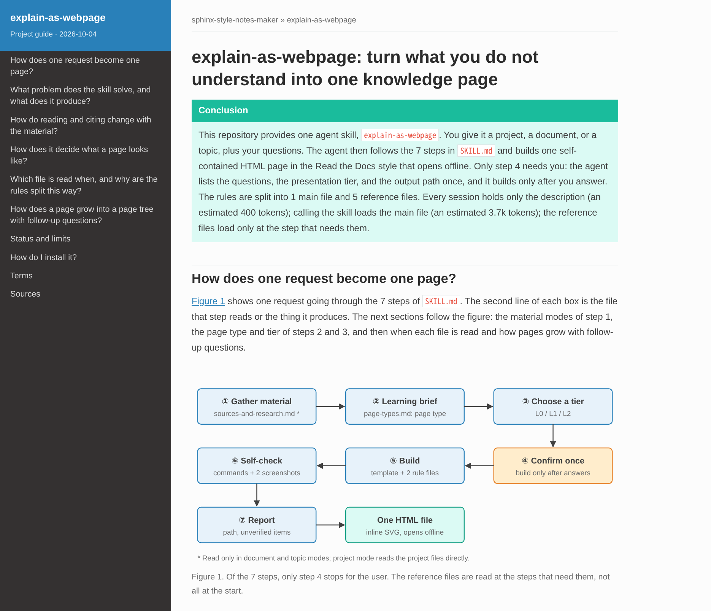

# Explain As Webpage

English | [繁體中文](README.zh-TW.md)



Let an AI coding agent turn a technique or design in your project that you do not understand into a knowledge web page, **with your own project as the example**. It also works without a project: give it an article, a PDF, or Markdown notes, or only name a topic, and it researches and grades the sources.

## Inspiration

This repository provides one skill, `explain-as-webpage`, inspired by Andrej Karpathy's post: [x.com/karpathy/status/2105819303471976479](https://x.com/karpathy/status/2105819303471976479).


This skill implements the first three suggestions in the post. Its writing rules follow about 80% of ASD-STE100, its figures are inline SVG, and its output is a single HTML page that can include an in-browser step animation. It **deliberately stops before video**; see [What it does not do](#what-it-does-not-do).

## What it produces

- **One HTML file per page.** The page looks like Read the Docs (sphinx_rtd_theme). All figures are inline SVG and the page loads no external resources, so it opens offline. There is no build step and no extra `figures/` or `scripts/` folder.
- **Sections that are questions.** The page gives the conclusion first, then one causal chain. Each section answers one question the reader is stuck on, with real files, numbers, and code from the project.
- **The cheapest presentation tier that still answers the questions:**

| Tier | Form | Use for questions about |
|---|---|---|
| L0 | Text + static SVG | Structure, composition, a causal chain, before/after |
| L1 | L0 + collapsible blocks, one slider | A trade-off: the result depends on a parameter |
| L2 | L1 + step animation (previous / next / play) | A process: an iterative algorithm, events over time |

<details>
<summary>What each tier looks like</summary>

Screenshots from the [autoresearch example](#examples).

**L0: static figure.** One experiment's path through the repository.


**L1: one slider.** Moving the time-budget slider updates both bars and the numbers.


**L2: step animation.** Stepping through the experiment loop, one change per step.


</details>

- **Page's Language.** The page uses the language you ask for. If you do not ask, it uses the language you write in.
- **Pages that grow with follow-up questions.** When you ask more about an existing page, the agent decides where each answer goes. A short answer to an existing question goes into a collapsible block on that page. A new question gets a child page, linked to and from the hub page. A finding that changes the main conclusion revises the hub page. Each page keeps its own length budget, so the hub page does not keep growing.

The agent first lists the questions, the proposed tier, and the output path, and **builds only after you confirm**. The default output path is outside your project: `~/Documents/explainers/<repo-name>/<topic>.html` for a project, or `~/Documents/explainers/<topic>/<topic>.html` for a document or a topic.

## Examples

**This repository.** [`examples/explain-as-webpage/explain-as-webpage.html`](examples/explain-as-webpage/explain-as-webpage.html) explains this skill in one L0 page: how one request becomes a page (followed through a real request), how reading and citing change with the material, how the page type and tier are chosen, which file is read when (with token estimates), how pages grow with follow-up questions, and how to install it. The cover image above is the top of this page: the sidebar, the conclusion, and Figure 1.

**karpathy/autoresearch.** [`examples/autoresearch/`](examples/autoresearch/) explains [karpathy/autoresearch](https://github.com/karpathy/autoresearch) (commit `228791f`, MIT license) in three pages:

| Page | Tier | Content |
|---|---|---|
| `autoresearch.html` (hub) | L2 | What the repository is for, what each of its three files does, and how to run it. Static figures for structure (L0), a slider for the 5-minute time budget trade-off (L1), a step animation for the experiment loop (L2) |
| `autoresearch--train-py.html` | L1 | Code walkthrough of `train.py`: model size, the two optimizers, the time-based learning-rate schedule |
| `autoresearch--prepare-py.html` | L0 | Code walkthrough of `prepare.py`: data, the validation shard, row packing, how `val_bpb` is computed |

The two child pages were added as follow-up questions, through the extension flow.

GitHub does not render HTML, so clone the repository and open a page locally:

```bash
xdg-open examples/explain-as-webpage/explain-as-webpage.html   # on macOS: open
xdg-open examples/autoresearch/autoresearch.html
```

## Installation

### Claude Code

Install it as a plugin. The installed skill name has the plugin prefix: `/sphinx-style-notes-maker:explain-as-webpage`.

```bash
claude plugin marketplace add elliewlh2094/sphinx-style-notes-maker   # or a local path
claude plugin install sphinx-style-notes-maker@sphinx-style-notes-maker
```

Or copy both skill folders and call it as `/explain-as-webpage`. `explainer-figure` draws the figures; `explain-as-webpage` reads it by a relative path, so the two folders must sit side by side:

```bash
cp -r skills/explain-as-webpage skills/explainer-figure ~/.claude/skills/
```

### Codex

Install it as a plugin. The installed skill name also has the plugin prefix: `sphinx-style-notes-maker:explain-as-webpage`.

```bash
codex plugin marketplace add elliewlh2094/sphinx-style-notes-maker   # or a local path
codex plugin add sphinx-style-notes-maker@sphinx-style-notes-maker
```

Or copy both skill folders and call it as `@explain-as-webpage`:

```bash
cp -r skills/explain-as-webpage skills/explainer-figure ~/.codex/skills/
```

After you install it, start a new session so that the tool loads the skill.

## Usage

Describe what you want to understand, or call the skill by name. For example:

- "I don't understand why the image matching needs RANSAC geometric verification. Use `docs/notebooks/XXX.md` and make a knowledge page."
- "What does the `src/swarm_experiment` package do, and why is it built this way? Explain it as a web page."
- "Continuing from `swarm-experiment-package.html`: what does each source file do?" (extends an existing page)
- "Make a page in English that explains what this repository is for and how to use it."
- "Turn this article into an easy-to-read page: https://gist.github.com/karpathy/442a6bf555914893e9891c11519de94f" (a document)
- "Make pages from `~/Downloads/robotics-roadmap.pdf`, one child page per stage." (a long document or a plan)
- "I want to understand how SpaceX reuses Starship. Research it and make a page for a non-specialist student." (a topic: the agent asks for light or deep research)
- "Make a health page about an overactive and an underactive thyroid for my parents." (a high-risk topic: authoritative sources only, with a caution box)

Open the result with `xdg-open <path>` (Linux) or `open <path>` (macOS).

## Repository layout

```text
skills/explain-as-webpage/
├── SKILL.md                    # Process and tier criteria (shared by Claude Code and Codex)
├── references/
│   ├── writing-rules.md        # Page skeleton, figures and text, readers, language and length rules
│   ├── page-types.md           # Page types and their spine figures (mechanism, package, code, argument, plan, guide, evolution)
│   ├── sources-and-research.md # Document and topic modes: full text, research, source grades, helper skills, high-risk topics
│   └── extending-pages.md      # Follow-up questions: where answers go, the page tree, sync checks
└── assets/
    └── template.html           # Single-file Read the Docs-style template
skills/explainer-figure/        # Draws the figures; read only by explain-as-webpage
├── SKILL.md                    # Figure brief, figure type choice, self-check
└── references/
    └── svg-recipes.md          # SVG layout rules, color meaning, figure recipes, axes, step animation and slider
examples/explain-as-webpage/    # Example: one page that explains this repository (English and Traditional Chinese)
examples/autoresearch/          # Example: hub page + two code walkthrough pages
examples/llm-wiki/              # Example (Traditional Chinese): a page from a document
examples/starship-reusability/  # Example (Traditional Chinese): a page from researched sources
.claude-plugin/                 # Claude Code plugin and marketplace manifests
.codex-plugin/                  # Codex plugin manifest
.agents/plugins/                # Codex marketplace manifest
docs/ideas/                     # Idea one-pagers
docs/specs/                     # Specification of the current round (material modes)
docs/images/                    # README images: covers, the post screenshot, the three tiers
tasks/                          # Implementation plan and task list
```

## What it does not do

- **Video, as output or as material.** The highest tier is an in-browser step animation; no manim, ffmpeg, or text-to-speech. A video toolchain costs much more to run, and a step animation already covers questions about a process. A video URL is not accepted as material either, because the agent cannot watch it.
- **External CDNs** such as MathJax, D3, or Mermaid. Formulas use HTML superscripts and subscripts.
- **A Sphinx build.** Only the look is borrowed.
- **A cross-topic index or knowledge base.** A page tree stays inside one topic (one hub page and its child pages), to keep maintenance low.

## License

MIT
