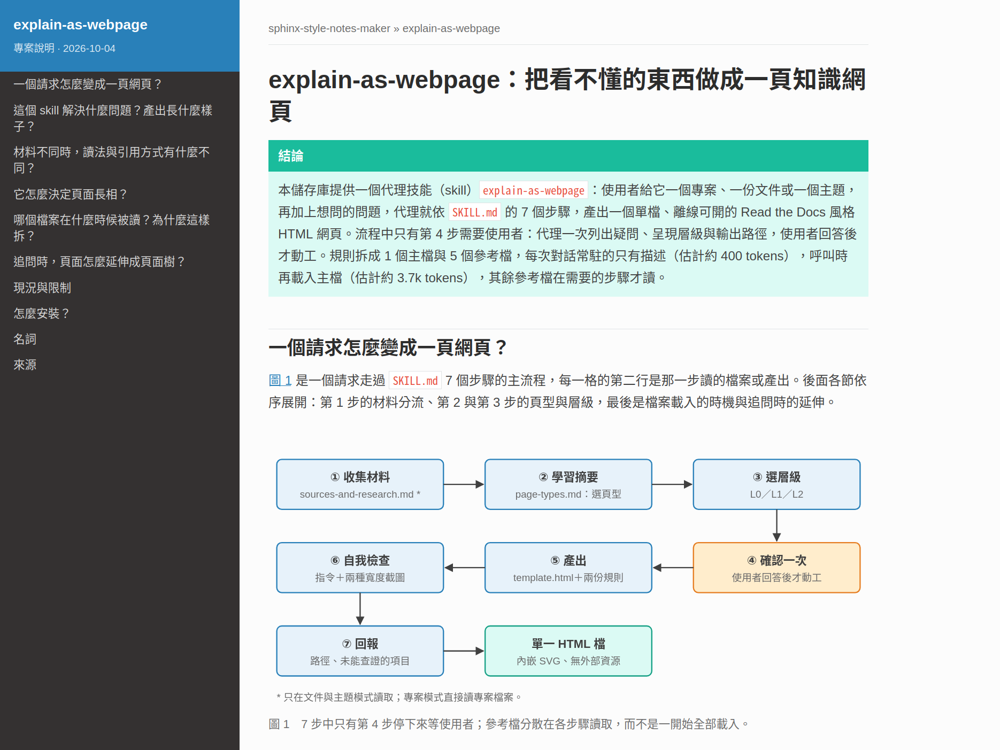
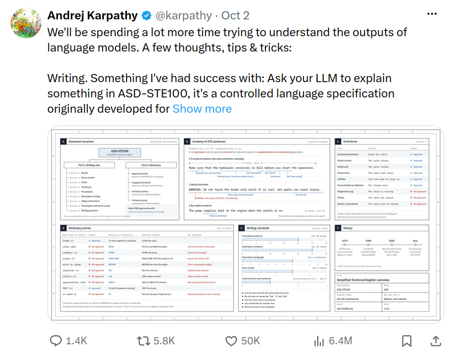
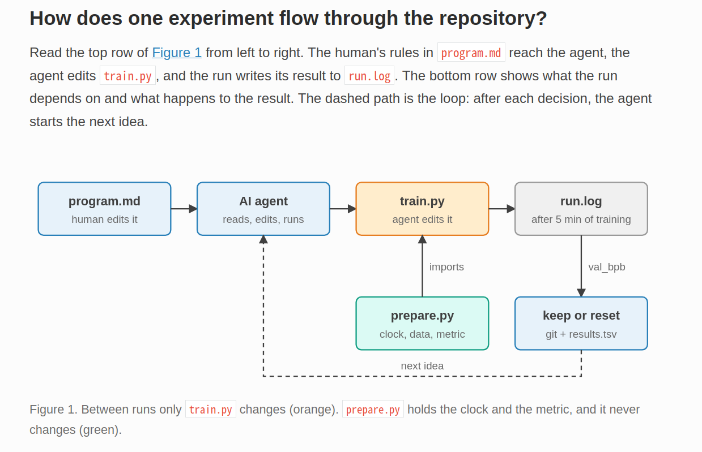
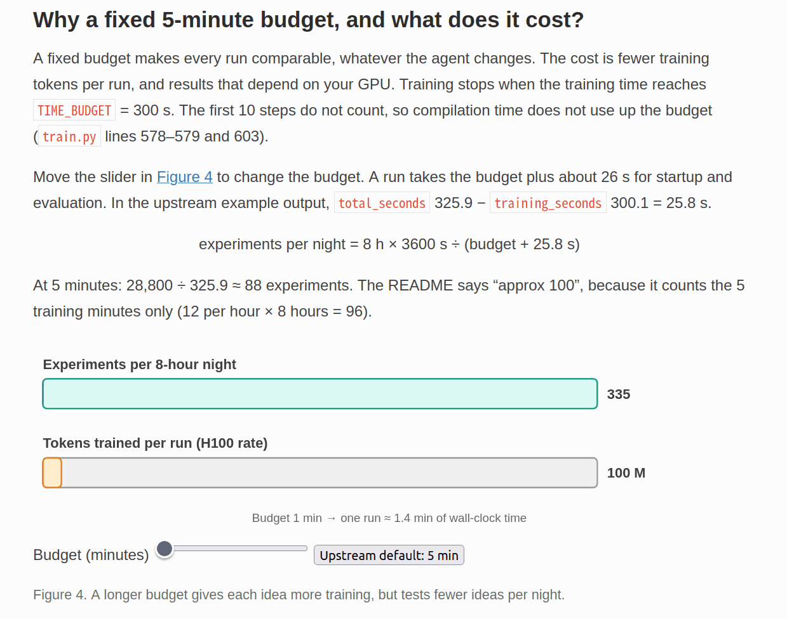
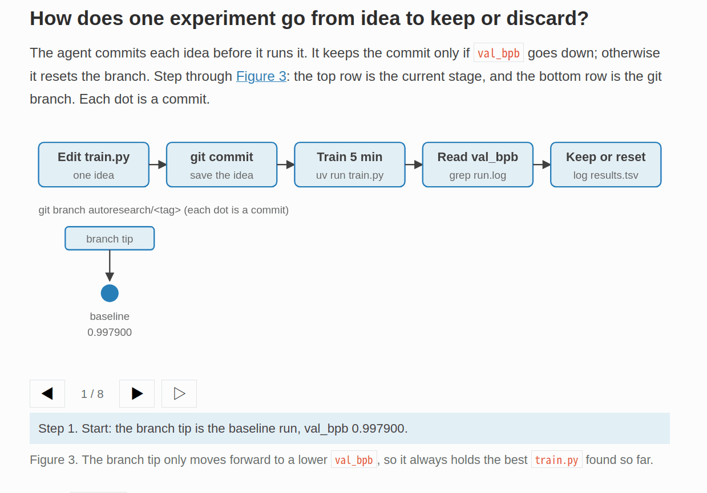

# Explain As Webpage

[English](README.md) | 繁體中文



讓 AI 代理把「你專案裡用到、但你不熟悉的技術或設計」做成**以你的專案為例**的知識網頁。沒有專案也能用：給它一篇網路文章、一份 PDF 或 Markdown 筆記，或只給一個主題，由它查證並為來源分級。

## 靈感來源

本儲存庫提供一個 skill：`explain-as-webpage`，靈感來自 Andrej Karpathy 的貼文：[x.com/karpathy/status/2105819303471976479](https://x.com/karpathy/status/2105819303471976479)。



本 skill 實作貼文內分享的前三項：寫作規則約為「八成的 ASD-STE100」，圖片是內嵌 SVG，成品是單一 HTML 網頁，並可加上瀏覽器內的逐步動畫。本 skill **刻意不做影片**，理由見[刻意不做的事](#刻意不做的事)。

## 它會產出什麼

- **單一 HTML 檔**：外觀仿照 Read the Docs（sphinx_rtd_theme），圖片全部是內嵌 SVG，不連外部資源，可以離線開啟。不需要建置，也不會另外產生 `figures/` 或 `scripts/` 資料夾。
- **以疑問為章節**：先給結論，再畫一條因果鏈。每一節回答一個讀者真正卡住的問題，並用專案的真實檔案、數據與程式碼舉例。
- **依主題選擇成本最低、但仍足以說明的呈現層級**：

| 層級 | 形式 | 適用的疑問 |
|---|---|---|
| L0 | 文字＋靜態 SVG | 結構、組成、因果鏈、前後對照 |
| L1 | L0＋展開區塊、一個滑桿 | 結果隨某個參數變化的取捨 |
| L2 | L1＋逐步動畫（上一步／下一步／播放） | 迭代演算法、隨時間演進的過程 |

<details>
<summary>各層級的實際樣貌</summary>

以下截圖取自英文範例 `examples/autoresearch/`。

**L0：靜態圖。** 一次實驗在儲存庫中的流程。



**L1：一個滑桿。** 拖動時間預算滑桿，兩條長條與數字會跟著更新。



**L2：逐步動畫。** 逐步播放實驗迴圈，每一步只改變一件事。



</details>

- **頁面語言**：頁面語言依你的要求決定；沒有指定時，跟隨你提問使用的語言。
- **可依追問延伸**：對既有頁面繼續追問時，代理會依判準決定落點。短答且屬於既有疑問，補進原頁的展開區塊；新的疑問，另開子頁並與主頁互相連結；會改變主結論，則修訂主頁。每一頁各自遵守篇幅預算，主頁不會越補越長。

代理會先列出疑問清單、建議的層級與輸出路徑，**等你確認後才開始產出**。預設輸出位置在你的專案之外：專案是 `~/Documents/explainers/<repo 名稱>/<主題>.html`，文件或主題是 `~/Documents/explainers/<主題>/<主題>.html`。

## 範例

**本儲存庫。** [`examples/explain-as-webpage/explain-as-webpage.zh-TW.html`](examples/explain-as-webpage/explain-as-webpage.zh-TW.html) 以單一 L0 頁面說明這個 skill：一個請求怎麼變成一頁網頁（以一個實際請求貫穿）、材料不同時讀法與引用方式的差別、頁型與層級怎麼決定、各檔案在什麼時候被讀取（附 token 估計值）、追問時頁面怎麼延伸，以及安裝方式。上方的封面圖是這一頁的開頭：側欄、結論與圖 1。

**文件：Karpathy 的〈LLM Wiki〉。** [`examples/llm-wiki/llm-wiki.html`](examples/llm-wiki/llm-wiki.html) 把 [LLM Wiki gist](https://gist.github.com/karpathy/442a6bf555914893e9891c11519de94f) 做成一頁 L2 網頁（document 模式）：它和 RAG 的差別（以逐步動畫對兩者依序加入三份來源並提出一個問題）、三層結構、Ingest、Query、Lint 三種操作，以及同一個問題用兩種做法回答的對照。每個事實都標出原文的段落。

**主題：SpaceX Starship 與可復用火箭。** [`examples/starship-reusability/starship-reusability.html`](examples/starship-reusability/starship-reusability.html) 由查證並分級的來源寫成（topic 模式，資料截至 2026-10-04）：以 NASA 的數字實際計算火箭方程式、兩節的分工、以逐步動畫呈現的助推器返回過程、飛船再入為何比較難，以及取自 SpaceX 試飛報告的里程碑。

GitHub 不會直接顯示 HTML，請 clone 後在本機開啟：

```bash
xdg-open examples/explain-as-webpage/explain-as-webpage.zh-TW.html   # macOS 用 open
xdg-open examples/llm-wiki/llm-wiki.html
xdg-open examples/starship-reusability/starship-reusability.html
```

## 安裝

### Claude Code

用 plugin 安裝。安裝後的 skill 名稱會加上 plugin 前綴：`/sphinx-style-notes-maker:explain-as-webpage`。

```bash
claude plugin marketplace add elliewlh2094/sphinx-style-notes-maker   # 或本機路徑
claude plugin install sphinx-style-notes-maker@sphinx-style-notes-maker
```

也可以直接複製兩個 skill 資料夾，之後用 `/explain-as-webpage` 呼叫。`explainer-figure` 負責繪圖，`explain-as-webpage` 以相對路徑讀取它，所以兩個資料夾必須並列：

```bash
cp -r skills/explain-as-webpage skills/explainer-figure ~/.claude/skills/
```

### Codex

用 plugin 安裝。安裝後的 skill 名稱同樣會加上 plugin 前綴：`sphinx-style-notes-maker:explain-as-webpage`。

```bash
codex plugin marketplace add elliewlh2094/sphinx-style-notes-maker   # 或本機路徑
codex plugin add sphinx-style-notes-maker@sphinx-style-notes-maker
```

也可以直接複製兩個 skill 資料夾，之後用 `@explain-as-webpage` 呼叫：

```bash
cp -r skills/explain-as-webpage skills/explainer-figure ~/.codex/skills/
```

安裝後請開新的 session，讓工具重新載入 skill。

## 使用方式

直接描述你想看懂的東西，或明確呼叫 skill。例如：

- 「我不懂為什麼影像辨識要加 RANSAC 幾何驗證，參考 `docs/notebooks/XXX.md`，做成知識網頁。」
- 「`src/swarm_experiment` 這個套件在做什麼、為什麼這樣設計？用網頁解釋給我看。」
- 「接續 `swarm-experiment-package.html`，我想知道每個程式檔各在做什麼。」（延伸既有頁面）
- 「用英文做一頁網頁，解釋這個儲存庫的目的與使用方式。」
- 「把這篇文章整理成容易閱讀的知識網頁：https://gist.github.com/karpathy/442a6bf555914893e9891c11519de94f」（文件）
- 「把 `~/Downloads/robotics-roadmap.pdf` 做成網頁，每個階段一個子頁。」（長篇文件或計畫）
- 「我想了解 SpaceX 怎麼重複使用 Starship，請查資料做成給非本科大學生看的網頁。」（主題：代理會請你選輕量或深度查證）
- 「做一頁給我爸媽看的甲狀腺亢進與低下衛教網頁。」（高風險主題：只用權威來源，並加上「注意」框）

產出後，用 `xdg-open <路徑>`（Linux）或 `open <路徑>`（macOS）開啟。

## 目錄結構

```text
skills/explain-as-webpage/
├── SKILL.md                    # 流程與層級判準（Claude Code 與 Codex 共用）
├── references/
│   ├── writing-rules.md        # 頁面骨架、圖文綁定、讀者設定、語言與篇幅規則
│   ├── page-types.md           # 頁型與主軸圖（機制、套件、程式導讀、論證、計畫、實務指南、演進）
│   ├── sources-and-research.md # 文件與主題模式：取得全文、查證、來源等級、輔助 skill、高風險主題
│   └── extending-pages.md      # 依追問延伸頁面：落點判準、頁面樹、同步檢查
└── assets/
    └── template.html           # RTD 風格的單檔模板
skills/explainer-figure/        # 繪圖；只由 explain-as-webpage 讀取
├── SKILL.md                    # 圖說明單、圖型選擇、單圖自檢
└── references/
    └── svg-recipes.md          # SVG 版面規則、顏色語意、圖形配方、座標軸、逐步動畫與滑桿
examples/explain-as-webpage/    # 範例：說明本儲存庫的單頁網頁（英文與繁體中文）
examples/autoresearch/          # 範例：主頁＋兩個程式導讀子頁
examples/llm-wiki/              # 範例（繁中）：由文件產出的網頁
examples/starship-reusability/  # 範例（繁中）：由查證來源產出的網頁
.claude-plugin/                 # Claude Code 的 plugin 與 marketplace manifest
.codex-plugin/                  # Codex 的 plugin manifest
.agents/plugins/                # Codex 的 marketplace manifest
docs/ideas/                     # 構想摘要
docs/specs/                     # 本輪規格（材料模式）
docs/images/                    # README 用圖：封面、貼文截圖、三個層級截圖
tasks/                          # 實作計畫與待辦
```

## 刻意不做的事

- **影片（不產出，也不接受為材料）**：最高層級是瀏覽器內的逐步動畫，不使用 manim、ffmpeg 或語音合成。影片的工具鏈與產出成本高，而「過程」類的疑問用逐步動畫已能說明。代理無法觀看影片，所以也不接受影片網址作為材料。
- **外部 CDN**：例如 MathJax、D3、Mermaid。公式改用 HTML 上下標表示。
- **Sphinx 建置**：只仿照它的外觀。
- **跨主題索引或知識庫**：頁面樹只限於同一主題（一個主頁加上它的子頁），避免增加管理負擔。

## 授權

MIT
